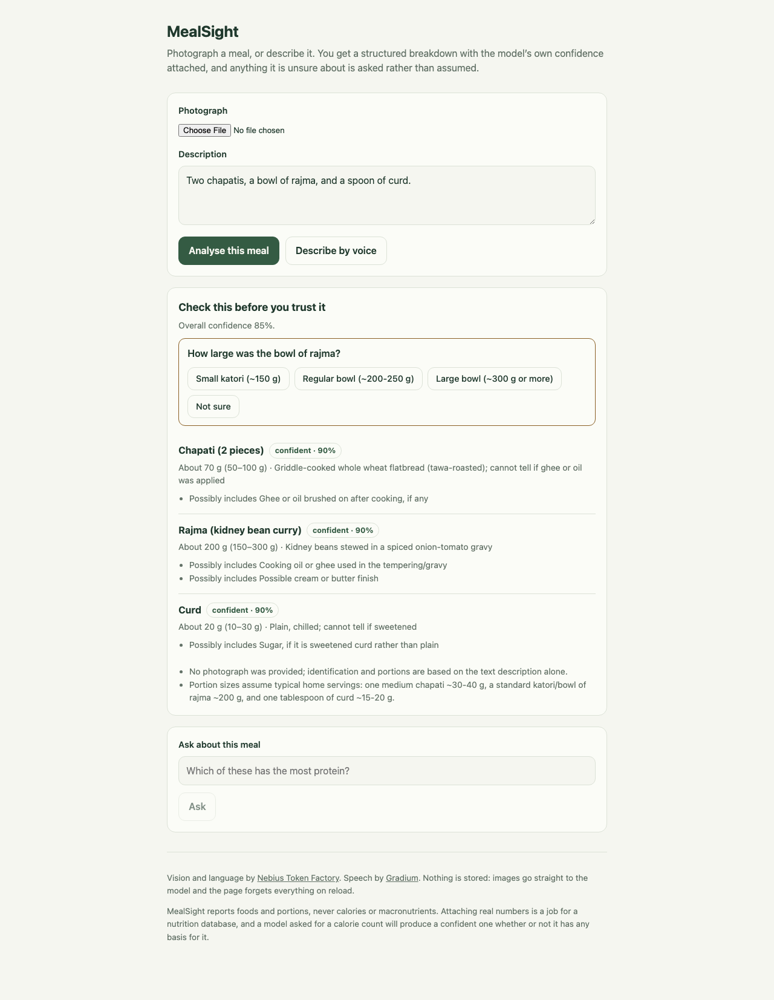

# MealSight

[Issues](https://github.com/shivaylamba/mealsight/issues) · [License](LICENSE)

**Photograph a meal and get a breakdown that admits what it does not know.**

MealSight sends a photo or a description to a vision model, then reads the
confidence the model reported alongside its answer instead of discarding it. A
confident reading is shown. An unsure one asks a question first. Something that
is not food is refused rather than logged.

It reports foods, portions and preparation. It never reports calories or
macronutrients, because a model asked for a calorie count will produce a
confident one whether or not it has any basis for it. Attaching real numbers is
a lookup against a nutrition database, and `lookup_query` on every food is there
for exactly that.

## How it works

```text
photo or description
        ↓
  Nebius VLM  ──→  strict schema  ──→  confidence gate  ──→  foods + questions
        ↑                                    │
   Gradium STT                               ├─ not food        → refused
   (spoken input)                            ├─ unsure          → ask first
                                             └─ confident       → show it
                                                     ↓
                                            Nebius LLM (ask about the meal)
                                                     ↓
                                            Gradium TTS (read it back)
```

The gate is the part worth stealing. Validating a model's JSON proves the shape
is right and nothing about whether the answer is sensible: `"I ate a car"`
parses perfectly into an item named *car*, and a photograph of a wall yields a
confident-looking list of foods. Most applications validate the shape, read the
items, and never look at the confidence sitting next to them.

- **Asks rather than infers.** `contains_food` is a field the model must set,
  not something guessed from an empty list. A model told only to list foods will
  list something for any image.
- **Judges edibility before quantity.** A stated weight does not make a
  substance food. Concrete, soap and paper are refused even when described
  precisely.
- **Keeps unsure meals.** The floor for refusal is 0.05, not 0.5. Low confidence
  usually means *I do not know the portion*, and "some leftover pasta, not sure
  how much" is a real meal that deserves a question, not a rejection.
- **Names what it cannot see.** Cooking oil, ghee, a possible cream finish: the
  things that change the answer and do not show up in a photograph.
- **Treats your words as evidence, never instructions.** Descriptions and
  transcripts are wrapped in delimiters that the text itself cannot close.

## Quickstart

Requires **Node.js 20+** and a [Nebius API key](https://tokenfactory.nebius.com).
Model calls bill to your own account. Voice is optional.

```bash
git clone https://github.com/shivaylamba/mealsight.git
cd mealsight
npm install
cp .env.example .env.local
```

Set `NEBIUS_API_KEY` in `.env.local`, then:

```bash
npm run dev
```

Open http://localhost:3000, describe a meal or pick a photograph, and press
**Analyse this meal**.

There is no default model, on purpose: an unset `NEBIUS_VISION_MODEL` fails with
a message naming the variable rather than quietly billing a model you did not
choose. `.env.example` suggests a working pair. Any vision-capable catalog model
will do, and `GET /api/health` reports which variables are still missing.

Add `GRADIUM_API_KEY` from [Gradium](https://gradium.ai) to describe meals by
voice and have answers read back. Without it the app works by typing, and the
health endpoint says so.

The schema reaches the model through the prompt by default
(`NEBIUS_RESPONSE_FORMAT=json_object`) rather than through constrained
`json_schema` decoding, because that is measurably more reliable here: over ten
runs of the two hardest descriptions, constrained decoding failed three times
against one. Zod validates the reply either way, so the difference is only how
often a failure reaches you. One retry on a schema mismatch covers the rest;
the same input at temperature 0 does not always parse, which is the evidence
that made a retry worth having.

## Under the hood

| Component | Purpose |
| --- | --- |
| Nebius Token Factory | Vision for reading the meal, language for answering questions about it. |
| Gradium | Speech to text for describing a meal aloud, text to speech for reading answers back. |
| Zod | The single source of truth for what a model is allowed to return. Extra fields are rejected, not ignored. |
| Next.js | The interface and the API routes, with no database and no account. |

Nothing is persisted. Images are sent to the model as data URLs and never
written to disk, and the page forgets everything on reload. That is a
deliberate limit, not a missing feature: this is the analysis core, and where
meals get stored is your decision.

Worth knowing before you build on it. The coach only ever sees the foods that
survived the gate, never the original photograph, so an answer cannot drift onto
evidence nobody reviewed. Provider failures are typed rather than guessed from
error text: a 429 carries its `Retry-After` through to the client, while a
rejected key is never retried because it will fail identically.

## Development

```bash
npm run lint        # 0 errors expected
npm run typecheck
npm test            # gate behaviour, schema strictness, prompt escaping
npm run build
```

The tests cover the parts that are easy to get quietly wrong: that a car is
refused, that an unsure but real meal is asked about rather than rejected, that
a nutrition field smuggled into a model response is rejected by the schema, and
that a description containing a closing delimiter cannot escape its block.

## Contributing

Contributions are welcome, from a typo to a new provider adapter.
[CONTRIBUTING.md](CONTRIBUTING.md) covers setup and what to run before opening a
pull request. Good places to start: a nutrition-database lookup driving
`lookup_query`, an adapter for another inference provider, or measuring the gate
thresholds against models this project has not tried.

If you change a threshold in `lib/gate.ts`, say what evidence moved it. The
current numbers came from running the same cases across a catalog of models and
watching which signal actually separated food from everything else. It was
`contains_food`, not confidence.

## License

MIT. See [LICENSE](LICENSE).
